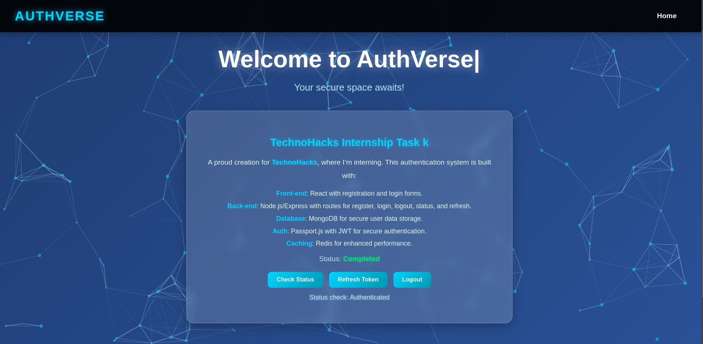

# 📚 AuthVerse - A Secure User Authentication System 🚀

Welcome to **AuthVerse**, a robust and secure user authentication API and frontend application built with Node.js, Express.js, MongoDB, Redis, and React! This project fulfills Task 2 of the TechnoHacks internship by providing a complete authentication system with user registration, login, token refresh, and logout functionality. Whether you’re securing an app or learning authentication, AuthVerse has you covered! 🌟

---

## 🚀 Project Overview

AuthVerse lets you:
- **Register** new users with a username, email, and password.
- **Login** securely to receive access and refresh tokens.
- **Check Status** to verify authentication state.
- **Refresh Tokens** for seamless session management.
- **Logout** to invalidate sessions securely.

Built as a full-stack application, it combines a RESTful backend with a dynamic React frontend—perfect for learning modern authentication workflows!

---

## 💡 Features

- ✅ **User Authentication**: Register, login, logout, and refresh tokens.
- ✅ **Token-Based Security**: JWT with Passport.js for secure access.
- ✅ **Session Management**: Redis caching for refresh tokens.
- ✅ **Frontend**: React-based UI with interactive elements (tilt animations, particle effects).
- ✅ **Security**: Helmet middleware, bcrypt password hashing, and CORS configuration.
- ✅ **Performance**: Redis caching for token storage and retrieval.
- ✅ **Persistence**: MongoDB for user data storage.
- ✅ **Health Check**: Monitor server status with `/api/health`.

---

## 🛠️ Tech Stack

### Backend:
- **Node.js**: Runtime environment.
- **Express.js**: RESTful API framework.
- **MongoDB**: NoSQL database with Mongoose ORM.
- **Redis**: In-memory caching for refresh tokens.
- **Passport.js**: Authentication middleware with JWT and Local strategies.
- **jsonwebtoken**: JWT generation and verification.
- **bcryptjs**: Password hashing.
- **Helmet**: Security middleware.
- **Morgan**: HTTP request logging.
- **CORS**: Cross-origin resource sharing.

### Frontend:
- **React**: Dynamic UI with routing via React Router.
- **axios**: HTTP client for API calls.
- **react-particles**: Interactive background effects.
- **vanilla-tilt**: 3D tilt animations.
- **react-typed**: Typing animation for welcome text.

### Tools:
- **Visual Studio Code**: Code editor.
- **Git**: Version control.
- **dotenv**: Environment variable management.
- **nodemon**: Auto-restart for development.
- **Thunder Client**: API testing (assumed).

---

## 📂 Project Structure

```
Authentication-System/
├── client/
│   ├── src/
│   │   ├── components/
│   │   │   ├── Register.js       # Registration form
│   │   │   ├── Login.js          # Login form
│   │   │   └── ProtectedRoute.js # Route guard
│   │   ├── App.js                # Main React app
│   │   └── App.css              # Styles
│   ├── public/                   # Static assets
│   └── package.json             # Frontend dependencies
├── server/
│   ├── config/
│   │   ├── passport.js          # Passport.js configuration
│   │   └── redis.js             # Redis connection
│   ├── models/
│   │   └── User.js              # Mongoose schema for users
│   ├── routes/
│   │   └── auth.js              # Authentication routes
│   ├── public/                  # Optional static files
│   ├── server.js                # Main server file
│   ├── .env                    # Environment variables
│   └── package.json            # Backend dependencies
├── .gitignore                  # Git ignore file
└── README.md                   # You’re here!
```
---

## 📸 Screenshots

- **API Response**: Example of a successful login!  
```
POST: http://localhost:5000/auth/login
Request:
{
"email": "test@example.com",
"password": "Test123$"
}
Response:
{
"status": "success",
"message": "Logged in successfully",
"data": {
"accessToken": "eyJhbGciOiJIUzI1NiIsInR5cCI6IkpXVCJ9...",
"refreshToken": "eyJhbGciOiJIUzI1NiIsInR5cCI6IkpXVCJ9..."
}
}
```

- **Frontend**: Home page with authenticated state and test buttons!  
  *(Imagine a React UI with a tilting task card, particle background, and buttons for "Check Status," "Refresh Token," and "Logout.")*
<p align="center">
  
</p>

## 🎥 Demo Video
Check out AuthVerse in action!  


---

## 📋 Prerequisites

- **Node.js**: v16+ recommended.
- **MongoDB**: Local instance or MongoDB Atlas.
- **Redis**: Local instance or Redis Cloud.
- **npm**: Package manager.
- **Git**: To clone the repo.

---

## 🚀 Setup & Installation

### 1️⃣ Clone the Repository:
```bash
git clone https://github.com/sureshbarach2001/Authentication-System.git
cd Authentication-System
```
### 2️⃣ Install Backend Dependencies:
```
cd server
npm install
```
### 3️⃣ Install Frontend Dependencies:
```
cd ../client
npm install
```


### 3️⃣ Set Up Environment Variables:
Create a .env file in the server/ directory:
```
PORT=5000
ACCESS_TOKEN_SECRET=your-access-secret
REFRESH_TOKEN_SECRET=your-refresh-secret
JWT_EXPIRES_IN=15m
JWT_REFRESH_EXPIRES_IN=7d
MONGO_URI=mongodb://localhost/auth-system
REDIS_HOST=127.0.0.1
REDIS_PORT=6379
REDIS_PASSWORD=your-redis-password
NODE_ENV=development
```
- Generate secrets with openssl rand -hex 32.
- Replace MONGO_URI with your MongoDB connection string if using Atlas.
- Update Redis settings as needed.
### 4️⃣ Start the Server:
```
cd server
npm start
```
- Runs on http://localhost:5000.

### 6️⃣ Start the Frontend:
```
cd ../client
npm start
```
- Runs on http://localhost:3000.
---
## 🌐 API Endpoints
- **POST /auth/register:** Register a new user.
- **POST /auth/login:** Log in and receive tokens.
- **GET /auth/status:** Check authentication status (requires token).
- **POST /auth/refresh:** Refresh access token using refresh token.
- **GET /auth/logout:** Log out and invalidate refresh token.
- **GET /api/health:** Check server, MongoDB, and Redis status.

Example Requests
- **POST /auth/register**
```
{
  "username": "testuser",
  "email": "test@example.com",
  "password": "Test123$"
}
Response:
{
  "status": "success",
  "message": "User registered successfully",
  "data": { "accessToken": "..." }
}
```
- **POST /auth/login**
```
{
  "email": "test@example.com",
  "password": "Test123$"
}
Response:
{
  "status": "success",
  "message": "Logged in successfully",
  "data": { "accessToken": "...", "refreshToken": "..." }
}
```
- **GET /auth/status**
```
Headers: { "Authorization": "Bearer <accessToken>" }
Response:
{
  "status": "success",
  "message": "Authentication status verified",
  "data": { "user": { "id": "...", "username": "testuser" } }
}
```

- **POST /auth/refresh**
```
{
  "refreshToken": "<refreshToken>"
}
Response:
{
  "status": "success",
  "message": "Token refreshed",
  "data": { "accessToken": "..." }
}
```
- **GET /auth/logout**
```
Headers: { "Authorization": "Bearer <accessToken>" }
Response:
{
  "status": "success",
  "message": "Logged out successfully"
}
```
---
## 📊 Project Status
Current Status: Complete (Task 3 MVP).
Version: 1.0.0
Last Updated: March 17, 2025

---
### ⚠️ Known Issues
- **Token Refresh:** No automatic refresh on 401 errors (manual button only).
- **Validation:** Limited input validation in frontend forms.
- **CORS:** Restricted to localhost—needs adjustment for production.
---
## 🔧 Future Enhancements
- **Auto Token Refresh:** Add axios interceptors for seamless token renewal.
- **Input Validation:** Use express-validator on backend and form validation on frontend.
- **User Profiles:** Extend with user details and avatar upload.
- **Rate Limiting:** Protect endpoints from abuse with express-rate-limit.
- **Deployment:** Host on cloud platforms like Heroku or Vercel.

---
## 🛠️ Contributing
- Fork this repo.
- Create a branch: git checkout -b feature/your-feature.
- Commit: git commit -m "Add cool stuff".
- Push: git push origin feature/your-feature.
- Open a Pull Request with details!
---
# 📞 Contact
- [**Portfolio**](https://sureshbarach2001.vercel.app/)
- [**GitHub**](https://github.com/sureshbarach2001)
- [**Email**](mailto:sainnk4831@gmail.com)

---
## 🎨 Design Highlights
- **RESTful:** Clean, intuitive endpoint structure.
- **Secure:** JWT with Passport.js and Redis-backed refresh tokens.
- **Interactive:** React frontend with animations and real-time feedback.
- **Scalable:** Ready for frontend expansion or cloud deployment.
